# 🗺️ Architecture Map

> **Auto-generated by [PatternBuddy](../.pattern-pointers.md).** Regenerated from the
> accumulated pattern memory after every merged PR — **do not edit by hand**, your
> changes will be overwritten on the next merge.
>
> Last updated: **PR #10 — feat: live review preview + one-click 'Update repo' PR (Soul Review /api)** · 2026-06-04

```mermaid
graph TD
  classDef clean fill:#d4edda,stroke:#28a745,color:#155724;
  classDef watch fill:#fff3cd,stroke:#ffc107,color:#856404;
  classDef danger fill:#f8d7da,stroke:#dc3545,color:#721c24;

  index[index.ts] -->|dispatches strategy ✅| runAnalysis[runAnalysis]
  index -->|dispatches strategy ✅| runArchitecture[runArchitecture]
  runAnalysis -->|calls ✅| inputBuilder[inputBuilder.ts]
  runAnalysis -->|calls ✅| historyLoader[historyLoader.ts]
  runAnalysis -->|calls ✅| claudeCaller[claudeCaller.ts]
  runAnalysis -->|calls ✅| commentPoster[commentPoster.ts]
  runAnalysis -->|calls ✅| mdUpdater[mdUpdater.ts]
  runArchitecture -->|calls ✅| architectureInput[architectureInput.ts]
  runArchitecture -->|calls ✅| architectureMapper[architectureMapper.ts]
  runArchitecture -->|calls ✅| architectureCommitter[architectureCommitter.ts]
  runArchitecture -->|calls ✅| architectureComment[architectureComment.ts]
  anthropicClient[anthropicClient.ts] -->|tight coupling to Actions runtime ⚠️| ActionsCore[ActionsCore]
  claudeCaller -->|tight coupling to Actions runtime ⚠️| ActionsCore
  commentPoster -->|tight coupling to Actions runtime ⚠️| ActionsCore
  commitFile[commitFile.ts] -->|tight coupling to Actions runtime ⚠️| ActionsCore
  architectureComment -->|tight coupling to Actions runtime ⚠️| ActionsCore
  architectureInput -->|tight coupling to Actions runtime ⚠️| ActionsCore
  claudeCaller -->|uses ✅| anthropicClient
  architectureMapper -->|uses ✅| anthropicClient
  claudeCaller -->|uses ✅| extractJson[extractJson.ts]
  architectureMapper -->|uses ✅| extractJson
  mdUpdater -->|calls ✅| commitFile
  mdUpdater -->|SRP violation - owns filesystem + commit ⚠️| commitFile
  mdUpdater -->|duplicate Octokit construction ⚠️| ActionsCore
  architectureCommitter -->|calls ✅| commitFile
  inputBuilder -->|unsafe type cast ⚠️| OctokitTypes[OctokitTypes]
  commitFile -->|unsafe type cast ⚠️| OctokitTypes
  mdUpdater -->|section header duplication ⚠️| historyLoader
  reviewHandler[api/review/index.js] -->|reads env inline 🔴| ProcessEnv[process.env]
  commitHandler[api/commit/index.js] -->|reads env inline 🔴| ProcessEnv
  reviewHandler -->|SRP violation - orchestration+prompt+call+normalise 🔴| AnthropicAPI[AnthropicAPI]
  commitHandler -->|tight coupling - token inline 🔴| GitHubAPI[GitHubAPI]
  reviewHandler -->|duplicate respond helper ⚠️| commitHandler
  apiLib[api.ts] -->|facade over fetch ✅| reviewHandler
  apiLib -->|facade over fetch ✅| commitHandler
  Editor[Editor.tsx] -->|calls ✅| apiLib
  Editor -->|calls ✅| storage[storage.ts]
  storage -->|implicit global state - localStorage 🔴| LocalStorage[localStorage]
  exportZip[exportZip.ts] -->|SRP violation - zip + DOM 🔴| DOMLayer[DOM]
  JournalEditor[JournalEditor.tsx] -->|index as key anti-pattern ⚠️| ReactDOM[ReactDOM]
  sampleStack[sample.ts] -->|magic number threshold ⚠️| ConfigValues[implicit config values]
  sampleStack -->|knowledge duplication across sections ⚠️| ConfigValues
  config[config.ts] -->|SRP improvement - extracted config ✅| inputBuilder
  DemoReviewPanel[DemoReviewPanel.tsx] -->|graceful degradation ✅| apiLib
  gitignore[.gitignore] -->|committed build artifact ⚠️| distBundle[dist/index.js]
  distBundle -->|DRY duplication of source ⚠️| claudeCaller

  class index clean;
  class runAnalysis clean;
  class runArchitecture clean;
  class inputBuilder watch;
  class historyLoader clean;
  class claudeCaller watch;
  class commentPoster watch;
  class mdUpdater watch;
  class architectureInput watch;
  class architectureMapper clean;
  class architectureCommitter clean;
  class architectureComment watch;
  class anthropicClient watch;
  class extractJson clean;
  class commitFile watch;
  class config clean;
  class reviewHandler danger;
  class commitHandler danger;
  class apiLib clean;
  class Editor clean;
  class storage danger;
  class exportZip danger;
  class JournalEditor watch;
  class sampleStack watch;
  class DemoReviewPanel clean;
  class gitignore watch;
  class distBundle watch;
  class ActionsCore watch;
  class ProcessEnv danger;
  class OctokitTypes watch;
  class AnthropicAPI clean;
  class GitHubAPI clean;
  class LocalStorage danger;
  class DOMLayer watch;
  class ReactDOM watch;
  class ConfigValues watch;
```

### Legend

- 🟢 **Clean** — sound patterns (Factory, Repository, SOLID-compliant, loose coupling)
- 🟡 **Watch** — tight coupling or emerging anti-patterns worth keeping an eye on
- 🔴 **Danger** — God classes, circular dependencies, high coupling centrality

### Architect's notes

The codebase has two distinct layers with very different health profiles. The pattern-buddy GitHub Actions pipeline (index.ts → strategy functions → context-threaded pipeline stages) is architecturally sound — it uses the Strategy and immutable Pipeline patterns well, and positive extractions like extractJson.ts and config.ts show the right instincts — but nearly every module that touches an external client (Octokit, Anthropic API key) hard-constructs that client internally rather than accepting it as a dependency, creating a pervasive Actions-runtime coupling smell across claudeCaller, commentPoster, commitFile, architectureInput, and architectureComment. The API layer (api/review and api/commit) is the highest-risk zone: both handlers collapse orchestration, prompt-building, API calls, and environment-variable resolution into single monolithic functions, violating SRP and making them untestable without live credentials. On the frontend, storage.ts and exportZip.ts are danger nodes — implicit localStorage coupling and DOM manipulation baked into business logic respectively — while the new api.ts facade and DemoReviewPanel graceful-degradation pattern are genuine bright spots. The team should prioritise dependency injection for infrastructure clients (Octokit, Anthropic) across the pattern-buddy layer, and decompose the two API handlers into discrete, testable units.
