# 🗺️ Architecture Map

> **Auto-generated by [PatternBuddy](../.pattern-pointers.md).** Regenerated from the
> accumulated pattern memory after every merged PR — **do not edit by hand**, your
> changes will be overwritten on the next merge.
>
> Last updated: **PR #15 — docs: promote pattern-buddy.com to the primary live URL (Azure as backup)** · 2026-06-04

```mermaid
graph TD
  classDef clean fill:#d4edda,stroke:#28a745,color:#155724;
  classDef watch fill:#fff3cd,stroke:#ffc107,color:#856404;
  classDef danger fill:#f8d7da,stroke:#dc3545,color:#721c24;

  index["index.ts"] -->|"dispatches strategy ✅"| runAnalysis["runAnalysis"]
  index -->|"dispatches strategy ✅"| runArchitecture["runArchitecture"]
  index -->|"threads context ✅"| inputBuilder["inputBuilder.ts"]
  index -->|"threads context ✅"| historyLoader["historyLoader.ts"]
  index -->|"threads context ✅"| claudeCaller["claudeCaller.ts"]
  index -->|"threads context ✅"| commentPoster["commentPoster.ts"]
  index -->|"threads context ✅"| mdUpdater["mdUpdater.ts"]
  index -->|"threads context ✅"| architectureMapper["architectureMapper.ts"]
  index -->|"threads context ✅"| architectureCommitter["architectureCommitter.ts"]
  index -->|"threads context ✅"| architectureComment["architectureComment.ts"]

  inputBuilder -->|"reads process.cwd() tight coupling ⚠️"| envRuntime["Env/Runtime"]
  inputBuilder -->|"unsafe cast 🔴"| octokitSDK["Octokit SDK"]
  inputBuilder -->|"loads skills ✅"| skillLoader["skillLoader.ts"]

  claudeCaller -->|"reads API key inline ⚠️"| envRuntime
  claudeCaller -->|"uses factory ✅"| anthropicClient["anthropicClient.ts"]
  claudeCaller -->|"shared utility ✅"| extractJson["extractJson.ts"]

  anthropicClient -->|"consolidated coupling ⚠️"| envRuntime
  anthropicClient -->|"creates client ✅"| anthropicAPI["Anthropic API"]

  commentPoster -->|"reads token inline ⚠️"| envRuntime
  commentPoster -->|"calls GitHub API ⚠️"| octokitSDK
  commentPoster -->|"graceful degradation ✅"| githubReviewAPI["GitHub Review API"]

  mdUpdater -->|"dual Octokit clients ⚠️"| octokitSDK
  mdUpdater -->|"SRP violation 🔴"| filesystem["Filesystem"]
  mdUpdater -->|"delegates write ✅"| commitFile["commitFile.ts"]

  commitFile -->|"reads token inline ⚠️"| envRuntime
  commitFile -->|"unsafe cast 🔴"| octokitSDK

  architectureMapper -->|"calls Claude ✅"| claudeCaller
  architectureMapper -->|"shared utility ✅"| extractJson
  architectureMapper -->|"immutable spread ✅"| architectureContext["ArchitectureContext"]

  architectureCommitter -->|"delegates write ✅"| commitFile

  architectureComment -->|"reads token inline ⚠️"| envRuntime
  architectureComment -->|"calls GitHub API ⚠️"| octokitSDK

  architectureInput["architectureInput.ts"] -->|"reads token inline ⚠️"| envRuntime
  architectureInput -->|"calls GitHub API ⚠️"| octokitSDK

  historyLoader -->|"simplified load ✅"| filesystem

  config["config.ts"] -->|"owns config schema ✅"| inputBuilder

  skillLoader -->|"no Actions deps ✅"| filesystem
  skillLoader -->|"injected into prompt ✅"| promptTemplate["prompt.template.ts"]

  promptTemplate -->|"reads skills from context ✅"| inputBuilder

  apiReview["api/review/index.js"] -->|"reads API key inline 🔴"| envRuntime
  apiReview -->|"SRP violation 🔴"| anthropicAPI
  apiReview -->|"graceful stub fallback ✅"| stubPattern["Stub/Fallback"]
  apiReview -->|"duplicate respond helper ⚠️"| apiCommit["api/commit/index.js"]

  apiCommit -->|"reads token inline 🔴"| envRuntime
  apiCommit -->|"calls GitHub REST 🔴"| githubRESTAPI["GitHub REST API"]
  apiCommit -->|"duplicate respond helper ⚠️"| apiReview

  apiLib["src/lib/api.ts"] -->|"clean facade ✅"| apiReview
  apiLib -->|"clean facade ✅"| apiCommit

  editorComponent["Editor/DemoReviewPanel"] -->|"thin client ✅"| apiLib

  exportZip["exportZip.ts"] -->|"SRP violation 🔴"| domAPI["DOM API"]
  exportZip -->|"zip logic coupled to DOM 🔴"| browserDownload["Browser Download"]

  storage["storage.ts"] -->|"global singleton coupling ⚠️"| localStorage["localStorage"]

  sampleTs["sample.ts"] -->|"magic thresholds implicit ⚠️"| soulStack["SoulStack Config"]
  sampleTs -->|"knowledge duplication ⚠️"| soulStack

  typesTs["types.ts"] -->|"inverted dependency ⚠️"| skillLoader

  distBundle["dist/index.js"] -->|"committed artifact ⚠️"| index

  class index clean;
  class runAnalysis clean;
  class runArchitecture clean;
  class inputBuilder watch;
  class historyLoader clean;
  class claudeCaller watch;
  class anthropicClient watch;
  class commentPoster watch;
  class mdUpdater danger;
  class commitFile danger;
  class architectureMapper clean;
  class architectureCommitter clean;
  class architectureComment watch;
  class architectureInput watch;
  class config clean;
  class skillLoader clean;
  class promptTemplate clean;
  class extractJson clean;
  class apiReview danger;
  class apiCommit danger;
  class apiLib clean;
  class editorComponent clean;
  class exportZip danger;
  class storage watch;
  class sampleTs watch;
  class typesTs watch;
  class distBundle watch;
  class envRuntime danger;
  class octokitSDK watch;
  class anthropicAPI clean;
  class githubReviewAPI clean;
  class githubRESTAPI watch;
  class filesystem clean;
  class domAPI watch;
  class browserDownload watch;
  class localStorage watch;
  class soulStack watch;
  class stubPattern clean;
  class architectureContext clean;
```

### Legend

- 🟢 **Clean** — sound patterns (Factory, Repository, SOLID-compliant, loose coupling)
- 🟡 **Watch** — tight coupling or emerging anti-patterns worth keeping an eye on
- 🔴 **Danger** — God classes, circular dependencies, high coupling centrality

### Architect's notes

The codebase has two distinct sub-systems — a GitHub Actions pipeline (pattern-buddy) and a browser/API layer (src + api) — connected through shared patterns more than shared code. The Actions pipeline has a strong immutable-pipeline backbone and good extraction of shared utilities (extractJson, commitFile, skillLoader), but is riddled with a codebase-wide structural habit: every module that needs an infrastructure client (Octokit, Anthropic, env vars) constructs it internally rather than accepting it as a dependency, making most business-logic functions untestable in isolation. The API handlers (api/review, api/commit) are the highest-risk zone — they compound the tight-coupling habit with SRP violations, scattering multiple orchestration responsibilities into single 230-line functions with no shared config abstraction. The browser layer shows the same coupling instinct in a different form: exportZip folds DOM manipulation into serialization logic, and storage.ts is implicitly welded to localStorage, while the clean api.ts facade and the well-decoupled skillLoader demonstrate that the team knows what good boundaries look like when they apply them.
