# 🗺️ Architecture Map

> **Auto-generated by [PatternBuddy](../.pattern-pointers.md).** Regenerated from the
> accumulated pattern memory after every merged PR — **do not edit by hand**, your
> changes will be overwritten on the next merge.
>
> Last updated: **PR #11 — feat: add architecture review skill to soul stack** · 2026-06-04

```mermaid
graph TD
  classDef clean fill:#d4edda,stroke:#28a745,color:#155724;
  classDef watch fill:#fff3cd,stroke:#ffc107,color:#856404;
  classDef danger fill:#f8d7da,stroke:#dc3545,color:#721c24;

  index["index.ts"] -->|"dispatches strategy ✅"| runAnalysis["runAnalysis"]
  index -->|"dispatches strategy ✅"| runArchitecture["runArchitecture"]
  index -->|"immutable pipeline ✅"| inputBuilder["inputBuilder"]
  index -->|"immutable pipeline ✅"| claudeCaller["claudeCaller"]
  index -->|"immutable pipeline ✅"| commentPoster["commentPoster"]
  index -->|"immutable pipeline ✅"| mdUpdater["mdUpdater"]
  index -->|"immutable pipeline ✅"| architectureMapper["architectureMapper"]
  index -->|"immutable pipeline ✅"| architectureInput["architectureInput"]
  index -->|"immutable pipeline ✅"| architectureCommitter["architectureCommitter"]
  index -->|"immutable pipeline ✅"| architectureComment["architectureComment"]

  anthropicClient["anthropicClient"] -->|"consolidated env coupling ⚠️"| ActionsCore["ActionsCore"]
  claudeCaller -->|"calls ✅"| anthropicClient
  claudeCaller -->|"calls ✅"| extractJson["extractJson"]
  architectureMapper -->|"calls ✅"| extractJson
  architectureMapper -->|"calls ✅"| anthropicClient

  commentPoster -->|"tight coupling 🔴"| ActionsCore
  architectureComment -->|"tight coupling 🔴"| ActionsCore
  architectureInput -->|"tight coupling 🔴"| ActionsCore
  commitFile["commitFile"] -->|"tight coupling 🔴"| ActionsCore
  mdUpdater -->|"tight coupling 🔴"| ActionsCore
  mdUpdater -->|"dual Octokit ⚠️"| commitFile
  mdUpdater -->|"SRP violation ⚠️"| GitHubAPI["GitHubAPI"]

  commitFile -->|"unsafe cast ⚠️"| GitHubAPI
  inputBuilder -->|"unsafe cast ⚠️"| GitHubAPI
  architectureComment -->|"depends on ✅"| architectureMapper
  architectureCommitter -->|"depends on ✅"| commitFile

  apiReview["api/review"] -->|"env coupling 🔴"| ProcessEnv["ProcessEnv"]
  apiReview -->|"SRP violation 🔴"| AnthropicAPI["AnthropicAPI"]
  apiReview -->|"graceful degradation ✅"| buildStub["buildStub"]
  apiCommit["api/commit"] -->|"env coupling 🔴"| ProcessEnv
  apiCommit -->|"tight coupling 🔴"| GitHubAPI
  apiReview -->|"duplicate respond helper ⚠️"| apiCommit

  apiLib["src/lib/api.ts"] -->|"facade ✅"| apiReview
  apiLib -->|"facade ✅"| apiCommit
  Editor["Editor"] -->|"calls via facade ✅"| apiLib
  Editor -->|"depends on ✅"| DemoReviewPanel["DemoReviewPanel"]
  DemoReviewPanel -->|"open/closed extension ✅"| sampleReviewResult["sampleReviewResult"]

  exportZip["exportZip"] -->|"DOM coupling 🔴"| DOMLayer["DOMLayer"]
  exportZip -->|"SRP violation ⚠️"| ZipLogic["ZipLogic"]
  storage["storage"] -->|"localStorage coupling ⚠️"| LocalStorage["LocalStorage"]
  Editor -->|"depends on ✅"| storage
  Editor -->|"depends on ✅"| exportZip

  config["config.ts"] -->|"SRP extraction ✅"| inputBuilder
  sampleTs["sample.ts"] -->|"magic threshold ⚠️"| ArchHeuristics["ArchHeuristics"]
  sampleTs -->|"duplicated guidance ⚠️"| ArchHeuristics

  distBundle["dist/index.js"] -->|"committed artifact ⚠️"| index

  class index clean;
  class runAnalysis clean;
  class runArchitecture clean;
  class anthropicClient watch;
  class claudeCaller watch;
  class extractJson clean;
  class architectureMapper clean;
  class commentPoster danger;
  class architectureComment danger;
  class architectureInput danger;
  class architectureCommitter watch;
  class commitFile danger;
  class mdUpdater danger;
  class inputBuilder watch;
  class config clean;
  class apiReview danger;
  class apiCommit danger;
  class buildStub clean;
  class apiLib clean;
  class Editor clean;
  class DemoReviewPanel clean;
  class sampleReviewResult clean;
  class exportZip danger;
  class storage watch;
  class sampleTs watch;
  class distBundle watch;
  class ActionsCore watch;
  class GitHubAPI watch;
  class ProcessEnv danger;
  class DOMLayer watch;
  class ZipLogic clean;
  class LocalStorage watch;
  class ArchHeuristics watch;
```

### Legend

- 🟢 **Clean** — sound patterns (Factory, Repository, SOLID-compliant, loose coupling)
- 🟡 **Watch** — tight coupling or emerging anti-patterns worth keeping an eye on
- 🔴 **Danger** — God classes, circular dependencies, high coupling centrality

### Architect's notes

The codebase has two distinct sub-systems — a GitHub Actions pipeline (pattern-buddy/src/) and a web app with a serverless API (src/, api/) — connected by a shared coupling anti-pattern: every module that needs an external client (Octokit, Anthropic, env vars, DOM) constructs it inline rather than receiving it as a dependency. This is the single most pervasive danger zone, affecting commentPoster, architectureComment, architectureInput, commitFile, mdUpdater, api/review, and api/commit — all colored danger. The Actions pipeline's core orchestration (index.ts, the immutable pipeline, extractJson, config) is architecturally clean and well-structured, as is the client-side facade (api.ts, Editor, DemoReviewPanel). Priority remediation: introduce dependency injection at the infrastructure boundary (Octokit factory, Anthropic factory, env config module) so business-logic modules stop reaching into the runtime directly — this single change would promote six danger nodes to watch or clean.
