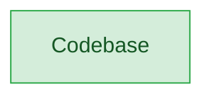

# 🗺️ Architecture Map

> **Auto-generated by [PatternBuddy](../.pattern-pointers.md).** Regenerated from the
> accumulated pattern memory after every merged PR — **do not edit by hand**, your
> changes will be overwritten on the next merge.
>
> _Pending first merge — this map populates automatically once a PR is merged with
> the architecture map enabled in `pattern-pointers.config.json`._

### Legend

- 🟢 **Clean** — sound patterns (Factory, Repository, SOLID-compliant, loose coupling)
- 🟡 **Watch** — tight coupling or emerging anti-patterns worth keeping an eye on
- 🔴 **Danger** — God classes, circular dependencies, high coupling centrality

### Architect's notes

_No notes generated yet._
