# 🗺️ Architecture Map

> **Auto-generated by [PatternBuddy](../.pattern-pointers.md).** Regenerated from the
> accumulated pattern memory after every merged PR — **do not edit by hand**, your
> changes will be overwritten on the next merge.
>
> Last updated: **PR #9 — feat(pattern-buddy): living architecture map generated after merge** · 2026-06-04

```mermaid
graph TD
  classDef clean fill:#d4edda,stroke:#28a745,color:#155724;
  classDef watch fill:#fff3cd,stroke:#ffc107,color:#856404;
  classDef danger fill:#f8d7da,stroke:#dc3545,color:#721c24;

  index["index.ts"] -->|"dispatches strategy ✅"| claudeCaller["claudeCaller.ts"]
  index -->|"dispatches strategy ✅"| commentPoster["commentPoster.ts"]
  index -->|"dispatches strategy ✅"| mdUpdater["mdUpdater.ts"]
  index -->|"dispatches strategy ✅"| architectureMapper["architectureMapper.ts"]
  index -->|"dispatches strategy ✅"| architectureComment["architectureComment.ts"]
  index -->|"dispatches strategy ✅"| inputBuilder["inputBuilder.ts"]
  index -->|"dispatches strategy ✅"| config["config.ts"]

  claudeCaller -->|"tight coupling ⚠️"| actionsCore["@actions/core"]
  claudeCaller -->|"tight coupling ⚠️"| processEnv["process.env"]
  claudeCaller -->|"uses ✅"| extractJson["extractJson.ts"]
  claudeCaller -->|"uses ✅"| anthropicClient["anthropicClient.ts"]

  anthropicClient -->|"tight coupling ⚠️"| actionsCore
  anthropicClient -->|"tight coupling ⚠️"| processEnv

  commentPoster -->|"tight coupling ⚠️"| actionsCore
  commentPoster -->|"graceful degradation ✅"| githubAPI["GitHub API"]

  architectureComment -->|"tight coupling ⚠️"| actionsCore
  architectureComment -->|"tight coupling ⚠️"| githubAPI

  commitFile["commitFile.ts"] -->|"tight coupling ⚠️"| actionsCore
  commitFile -->|"tight coupling ⚠️"| githubAPI
  commitFile -->|"unsafe cast ⚠️"| octokit["Octokit"]

  mdUpdater -->|"SRP violation 🔴"| localFS["Local Filesystem"]
  mdUpdater -->|"SRP violation 🔴"| githubAPI
  mdUpdater -->|"DRY violation ⚠️"| historyLoader["historyLoader.ts"]

  inputBuilder -->|"unsafe cast ⚠️"| octokit
  inputBuilder -->|"uses ✅"| config

  config -->|"SRP improvement ✅"| inputBuilder

  architectureMapper -->|"pipeline ✅"| extractJson
  architectureMapper -->|"pipeline ✅"| commitFile

  distBundle["dist/index.js"] -->|"committed artifact ⚠️"| index

  reviewHandler["api/review/index.js"] -->|"tight coupling 🔴"| processEnv
  reviewHandler -->|"SRP violation 🔴"| anthropicAPI["Anthropic API"]
  reviewHandler -->|"graceful degradation ✅"| buildStub["buildStub"]
  reviewHandler -->|"DRY violation ⚠️"| respondHelper["respond helper"]

  commitHandler["api/commit/index.js"] -->|"tight coupling 🔴"| processEnv
  commitHandler -->|"tight coupling 🔴"| githubAPI
  commitHandler -->|"DRY violation ⚠️"| respondHelper

  apiLib["src/lib/api.ts"] -->|"facade ✅"| reviewHandler
  apiLib -->|"facade ✅"| commitHandler

  exportZip["exportZip.ts"] -->|"tight coupling 🔴"| domAPI["DOM API"]
  exportZip -->|"SRP violation 🔴"| zipLogic["Zip Logic"]

  storage["storage.ts"] -->|"global state coupling ⚠️"| localStorage["localStorage"]

  journalEditor["JournalEditor.tsx"] -->|"magic index key ⚠️"| reactReconciler["React Reconciler"]
  journalEditor -->|"inline CSS DRY ⚠️"| classNameUtil["className strings"]

  skillMD["SKILL.md"] -->|"hardcoded credentials ⚠️"| azureConfig["Azure Config"]

  class index clean;
  class claudeCaller watch;
  class anthropicClient watch;
  class commentPoster watch;
  class architectureComment watch;
  class commitFile watch;
  class mdUpdater danger;
  class inputBuilder watch;
  class config clean;
  class extractJson clean;
  class architectureMapper clean;
  class distBundle watch;
  class reviewHandler danger;
  class commitHandler danger;
  class apiLib clean;
  class buildStub clean;
  class respondHelper watch;
  class exportZip danger;
  class storage watch;
  class journalEditor watch;
  class historyLoader watch;
  class skillMD watch;
  class actionsCore watch;
  class processEnv danger;
  class githubAPI clean;
  class anthropicAPI clean;
  class octokit watch;
  class localFS clean;
  class domAPI clean;
  class zipLogic clean;
  class localStorage clean;
  class reactReconciler clean;
  class classNameUtil watch;
  class azureConfig watch;
```

### Legend

- 🟢 **Clean** — sound patterns (Factory, Repository, SOLID-compliant, loose coupling)
- 🟡 **Watch** — tight coupling or emerging anti-patterns worth keeping an eye on
- 🔴 **Danger** — God classes, circular dependencies, high coupling centrality

### Architect's notes

The codebase has two major subsystems — the GitHub Actions pattern-buddy pipeline and the web app API/frontend — both suffering from the same structural habit: side-effectful infrastructure (Actions runtime, process.env, DOM, localStorage) is constructed inline inside business logic functions rather than injected as dependencies. This coupling is most severe in api/review/index.js and api/commit/index.js, which are danger-zone modules combining SRP violations, scattered env reads, and duplicated helper patterns. The pattern-buddy pipeline shows partial improvement (anthropicClient consolidates key resolution, extractJson eliminates duplication, config earns its own module) but tight coupling to @actions/core persists across nearly every module. The frontend exportZip.ts is a secondary danger zone mixing DOM side-effects with serialization logic, and the committed dist bundle adds chronic diff noise; the bright spots are the immutable pipeline threading in index.ts, the Facade in api.ts, and the graceful degradation patterns in commentPoster and reviewHandler.
